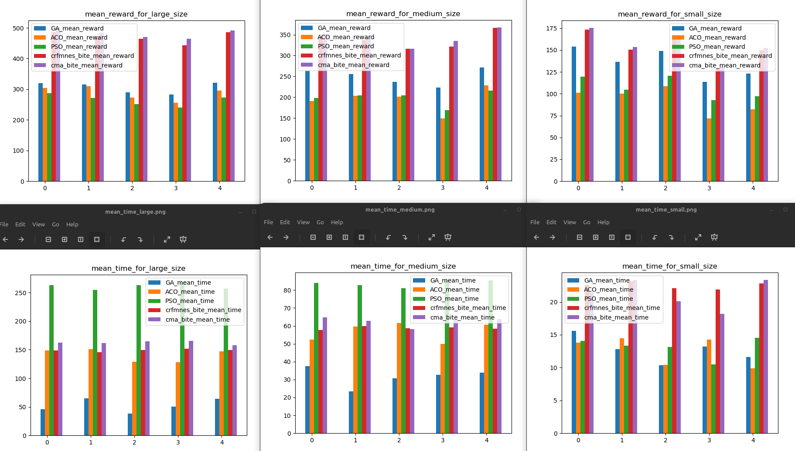
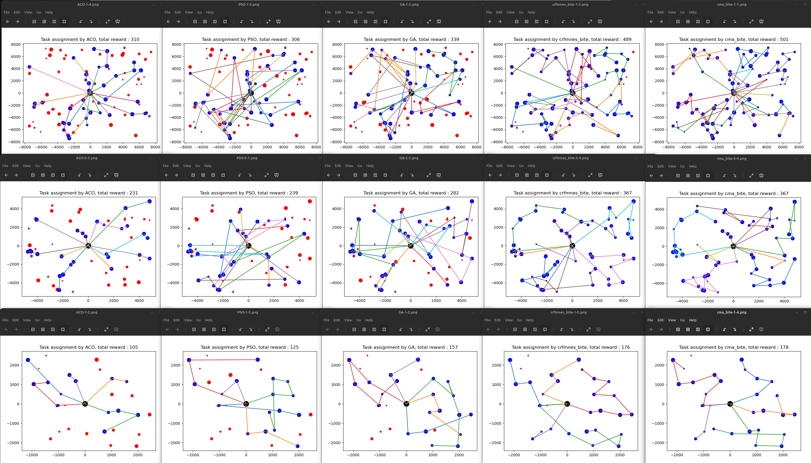

# Multi-UAV Task Assignment Benchmark (Enhanced Version)
## 多无人机任务分配算法测试基准

## Changes compared to [the original repo](https://github.com/robin-shaun/Multi-UAV-Task-Assignment-Benchmark)

1) GA uses [numba](https://numba.pydata.org/) for a dramatic speedup. Parameters are adapted so that the
    execution time remains the same: popsize 50 -> 300, iterations 500 -> 6000
    For this reason GA now performs much better compared to the original version.

2) Experiments are configured so that wall time for small size is balanced. This means:
    increased effort for GA, decreased effort for ACO. For medium / large 
    problem size you see which algorithms scale badly: Increase execution time superlinear
    in relation to the problem size. Avoid these for large problems. 

3) Adds standard continuous optimization algorithms based on: 
    - [BiteOpt](https://github.com/avaneev/biteopt) from Aleksey Vaneev
    - [CR-FM-NES](https://arxiv.org/abs/2201.11422) from Masahiro Nomura
    - [CMA-ES](https://cma-es.github.io/) from N. Hansen
    all using the same fitness function improving the one for GA.py. 
    These are by far the simplest implementations, only the fitness function needs
    to be coded, since we can use algorithms from the continuous optimization library 
    [fcmaes](https://github.com/dietmarwo/fast-cma-es). Execute "pip install fcmaes" to use it. 

4) Uses NestablePool to enable multiprocessing: Many fcmaes optimization runs
   are performed in parallel and the best result is returned. 
   
5) All results are created using an AMD 5950x 16 core processor
    utilizing all cores: 8 parallel threads for each fcmaes optimizer, 
    the other 3 algorithms remain single threaded. 

6) Added test_fcmaes.py where you can monitor the progress of fcmaes algorithms applied to the problem.

7) Added test_mode.py where you can monitor the progress of fcmaes-MODE applied to the problem and compare it
   for the same instance. fcmaes-MODE is a multi-objective optimizer applied to a 
   multi-objective variant of the problem.
   Objectives are: reward (to be maximized), maximal time (to be minimized), energy (to be minimized).
   The maximal time constraint from the single objective case is still valid.
   Energy consumption is approximated by `sum(dt*v*v)` 
   
8) Tests use the same seeds to generate the test problems for each run to enable the comparison of different
   runs.
   
## UPDATE

1) Now an enhanced version of the GA-fitness function is used for the continuous optimizers. This needs one 
additional decision variable and uses the np.argmin-trick to generate a sequence of unique indices from a 
list of continuous decision variables. Specially for large problems this improves the results significantly. 

2) We combined the single continuous algorithms to sequences - these work better for UAV.

3) Do 'pip install fcmaes --upgrade' before executing the experiments, since fcmaes version >= 1.4.2 is required.

## Introduction
A benchmark for multi-UAV task assignment is presented in order to evaluate different algorithms. An extended Team Orienteering Problem is modeled for a kind of multi-UAV task assignment problem. Three intelligent algorithms, i.e., Genetic Algorithm, Ant Colony Optimization and Particle Swarm Optimization are implemented to solve the problem. For comparison we additionally apply two continuous optimization algorithms using the 
[fcmaes optimization library](https://github.com/dietmarwo/fast-cma-es) for parallel execution.

A series of experiments with different settings are conducted to evaluate these five algorithms. The modeled problem and the evaluation results constitute a benchmark, which can be used to evaluate other algorithms used for multi-UAV task assignment problems.

Notice that the first three algorithms run single threaded, the two fcmaes continuous optimizers divide the remaining threads available on the machine to perform parallel optimization runs.
Optimization cannot easily utilize GPU resources, so at least we should utilize the whole CPU when comparing later with machine learning approaches. 

  

  

Please refer to the paper to see more detail.

Xiao, K., Lu, J., Nie, Y., Ma, L., Wang, X., Wang, G.: A Benchmark for Multi-UAV Task Assignment of an Extended Team Orienteering Problem. arXiv preprint **[ arXiv:2009.00363](https://arxiv.org/abs/2009.00363)**  (2020)

See [fcmaes](https://github.com/dietmarwo/fast-cma-es) and [BiteOpt](https://github.com/avaneev/biteopt) for details regarding fcmaes parallel retry and BiteOpt. 

## Usage

### 1. Algorithm input and output

Algorithm input includes vehicle number (scalar),  speeds of vehicles ($n\times1$ array), target  number (scalar $n$),  targets ($(n+1)\times4$ array, the first line is depot, the first column is x position, the second column is y position, the third column is reward and the forth column is time consumption to finish the mission), time limit (scalar).  The code below is the initialization of the class GA in `ga.py`.

```python
def __init__(self, vehicle_num, vehicles_speed, target_num, targets, time_lim)
```

There should be a function called `run()` in the algorithm class, and the function should return task assignment plan(array, e.g. [[28, 19, 11], [25, 22, 7, 16, 17, 23], [21, 26, 12, 9, 6, 3], [5, 15, 1], [18, 20, 29]], each subset is a vehicle path) and computational time usage (scalar). 

### 2. Evaluate

You can replace one algorithm  below with another algorithm in `evaluate.py`. If you don't want to evaluate six algorithm together, you should modify the code properly( this is easy).    

```python
        env = Env(vehicle_num,target_num,map_size,visualized=True)
        for i in range(num):
            env = Env(vehicle_num,target_num,map_size,visualized=True,seed=37*i+13)
            for j in range(num):
                opt_result = []
                p=NestablePool(mp.cpu_count())
                opt = [GA(vehicle_num,env.vehicles_speed,target_num,env.targets,env.time_lim),
                       ACO(vehicle_num,target_num,env.vehicles_speed,env.targets,env.time_lim),
                       PSO(vehicle_num,target_num ,env.targets,env.vehicles_speed,env.time_lim),
                       Optimizer(env,vehicle_num,env.vehicles_speed,target_num,env.targets,env.time_lim, crfmnes_bite(env.evals, M=6, popsize=env.popsize)),
                       Optimizer(env,vehicle_num,env.vehicles_speed,target_num,env.targets,env.time_lim, cma_bite(env.evals, M=6, popsize=env.popsize))]
                for k in range(onum):       
                    opt_result.append(p.apply_async(opt[k].run))
                p.close()
                p.join()
```

### 3. About reinforcement learning

In `Env()` in `evaluate.py`, function `step` is used for reinforcement learning. Because this is still being developed, we cannot supply a demo. If your algorithm is reinforcement learning, you can try to train it with `Env()`. Your pull request and issue are welcome.
